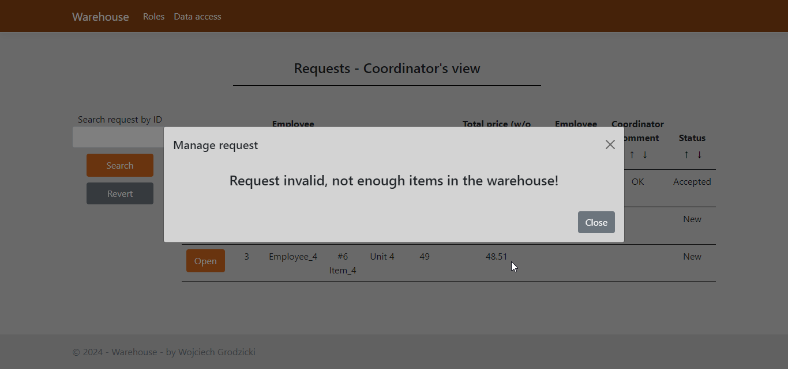

# **Warehouse**

"Warehouse" is a full-stack web application that simulates a simple warehouse management system.

## **Technologies used**

The back-end side of the application is written in C#, using the ASP.NET framework with Razor Pages, ADO.NET and SQLite for data storage.

The front-end is written in JavaScript, using Bootstrap for styling.

## **Features**

#### Roles

Upon launching the application you can choose how you want to interact with the system, either as a coordinator (with more rights) or as an employee (with less rights).

#### Coordinator's view

If you choose the coordinator role, you gain access to all items stored in the warehouse as well as to all requests with orders placed by the employees. You can also navigate back to the role selection page (by clicking the *Roles* button) or to the the coordinator options (by clicking the *Data access* button).

#### Coordinator's view - items

As a coordinator, you can browse items, add new ones, update or delete existing ones.

- *Adding items*. The *Add item* button opens a modal where you can define a new item to be added to the warehouse. You have to fill all the fields, except the location and the contact person. You also have to provide a valid quantity (at least 1) and price (at least 0.01).

- *Editing items*. The *Edit* button opens a modal where you have full access to the whole item data and can modify it as you please. Note that you have to provide valid information, as when adding an item. You can also delete the item, clicking on the *Delete* button.

- *Searching and sorting*. You can search for items based on their names by clicking the *Search* button and sort the table by each column, using the *arrow buttons* in column headers.

#### Coordinator's view - requests

As a coordinator, you have access to all requests. You can manage them by accepting or rejecting each request.

- *Managing requests*. The *Open* button opens a modal where you can manage a request. You can accept it or reject it, changing its status, or leave it as is. You can (but don't have to) leave a comment. When you accept a request for an item, this item's quantity is reduced by the amount purchased.

- *Safety check*. If you try to accept a request that would reduce the quantity below 0, your decision is rejected. After successfully accepting or rejecting the request, its status is updated, and you can no longer modify it.

- *Searching and sorting*. As with the items, you can search for requests based on their id by clicking the *Search* button and sort the table by each column, using the *arrow buttons* in column headers.

#### Employee's view - items

As an employee, you have limited access to all items. You can place requests by ordering items. You can also navigate back to the role selection page by clicking the *Roles* button.

- *Ordering items*. The *Order* button opens a modal where you can place a new order. You have to provide employee's name and the quantity, which has to be at least 1 and cannot be higher than the quantity of the item available in the warehouse.

- *Confirmation*. If your request was successfully processed, a confirmation message is displayed.

- *Searching and sorting*. As in the coordinator's view, you can search for items based on their name by clicking the *Search* button and sort the table by each column, using the *arrow buttons* in column headers.

## **Credits**

Created by Wojciech Grodzicki.